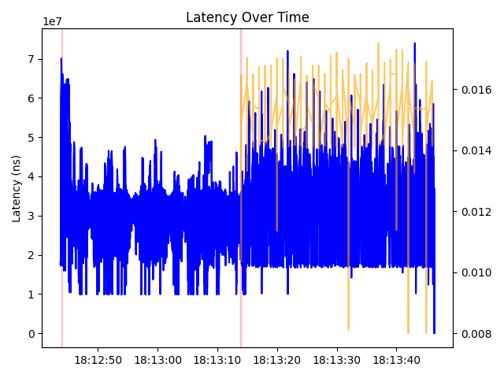

## January Update

### Change Log

- Turbo-Boost problems: previously, turbo-boost was being turned off via the intel_p folder, however, the experiments were being run on ARM CPUs on cloudlab, so thus, was not working. Switched experimentation to intel core nodes on cloudlab explicitly and the speed-ups with background work stopped!

    - this was with 100x100 matrix multiplication as the server response task.
    - with summing 100 numbers, the problem of slight speedup still occured with background noise (maybe more clients??).
        - what is the minimal work required for this to be nessecary?   

- Switched to matrix multiplication implemented in C.


### Results

#### No Cgroup baseline experiment
- Server Behavior:
    - no containerization
    - After 30 seconds: 8 instances of matrix multiplacation (100x100 repeatedly) begin.
- Client Behavior:
    - 8 clients persistently ping server.

```
P50: 30967485.0
P99: 44555693.269999996
P99.99: 49972093.64079964
P50: 33666976.5
P99: 49153716.23999999
P99.99: 72488438.22919933
```


- correctly, we see an increase in p50, p99, p99.9 when task is started.

#### Cgroup experiment

- Server Behavior:
    - containerization with two cgroups:
        - server-group: set to a weight of "max 100000", meaning no limit. 
        - background-cgroup: set to a weight of 50000 100000, meaning a 5% cap of cpu time.
    - After 30 seconds: 8 instances of matrix multiplacation (100x100 repeatedly) begin.
- Client Behavior:
    - 8 clients persistently ping server.

```
P50: 30595330.0
P99: 43325279.70000002
P99.99: 50399377.65499969
P50: 30529071.5
P99: 46574506.13
P99.99: 52445006.10119969
```


- correctly, we see a massive benefit of using cgroups now.


#### Cgroup and SCHED_IDLE experiment


- Server Behavior:
    - containerization with two cgroups:
        - server-group: set to a weight of "max 100000", meaning no limit. 
        - background-cgroup: set to a weight of 50000 100000, meaning a 5% cap of cpu time.
    - SCHED_IDLE policy used on background tasks.
    - After 30 seconds: 8 instances of matrix multiplacation (100x100 repeatedly) begin.
- Client Behavior:
    - 8 clients persistently ping server.

```
P50: 31315453.0
P99: 46696949.599999994
P99.99: 62803769.56099981
P50: 30349688.0
P99: 48222388.0
P99.99: 60269865.599999264
```


- not significant improvement, seems slightly worse than just cgroups...


### CDF


- GREEN: cgroups
- RED: cgroups and sched-idle
- ORANGE: no containerization

## Switch Experimentation Configuration

- server now performs a sum of 10,000 random numbers before responding instead of a 100x100 matrix multiplication. I also adjusted the max weight of the background cgroup to be 10%.

#### no cgroups


#### cgroups


#### cgroups and sched_idle


### CDF


- GREEN: cgroups
- RED: cgroups and sched-idle
- ORANGE: no containerization